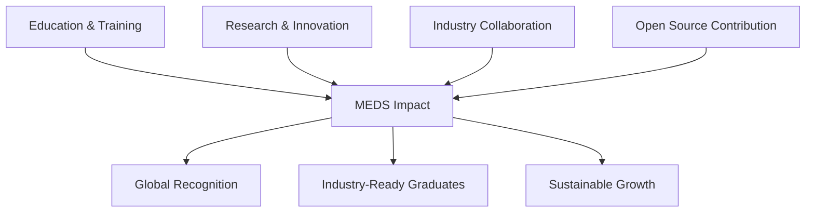

# Maktab e Digital Systems (MEDS)

  

---

## Our Mission

> **Building Tomorrow's Digital Systems Today**
> 
> MEDS is a cutting-edge research lab dedicated to advancing digital design and verification. We foster innovation, develop industry-leading projects, and produce highly skilled graduates who excel in both local and global markets.

---

## Our Research Domains

<table align="center">
<tr>
<td align="center" width="33%">

### 🔧 RISC-V Design
**Core Architecture Development**
- Custom processor designs
- Performance optimization
- Energy-efficient solutions
- Advanced pipelining

</td>
<td align="center" width="33%">

### ✅ Verification Excellence
**Robust Testing Frameworks**
- SystemVerilog testbenches
- UVM methodologies
- Formal verification
- Coverage-driven verification

</td>
<td align="center" width="33%">

### 💡 IP Development
**Industry-Grade Solutions**
- Reusable design components
- Verification IP libraries
- Standards compliance
- Commercial applications

</td>
</tr>
</table>

---

## 👥 Meet Our Team

### 🎯 Leadership Team

<table>
<tr>
<td align="center">
<b>Dr. Muhammad Tahir</b> 
<i>Lab Director</i> 
🎯 Strategy & Vision
</td>
<td align="center">
<b>Umer Shahid</b> 
<i>Faculty Manager</i> 
📚 Research Guidance
</td>
<td align="center">
<b>Shehzeen Malik</b> 
<i>Faculty Manager</i> 
🔬 Academic Integration
</td>
</tr>
</table>

---

## 📊 Lab Statistics

---

## 🎯 Key Focus Areas

<table>
<tr>
<td align="center" width="25%">

<h4>🔧 RISC-V Design</h4>

Advanced processor architectures and custom solutions

</td>
<td align="center" width="25%">

<h4>✅ Verification</h4>

Comprehensive testing and validation frameworks

</td>
<td align="center" width="25%">

<h4>💻 Open Source</h4>

Contributing to global RISC-V ecosystem

</td>
<td align="center" width="25%">

<h4>🎓 Education</h4>

Training next-generation engineers

</td>
</tr>
</table>

---

## 🏆 Our Achievements

### 🌟 Success Metrics

| Category | Achievement | Impact |
|----------|-------------|---------|
| 🎓 **Education** | Industry-ready graduates | 100% placement success |
| 🔬 **Research** | Cutting-edge projects | International recognition |
| 🤝 **Collaboration** | Industry partnerships | Real-world solutions |
| 🌍 **Global Presence** | RISC-V community | Open-source contributions |
| 💰 **Sustainability** | Self-funded operations | Independent growth |

---

## 🚀 Current Projects

### Featured Repositories

TBA

---

## 🌐 Connect With Us

---

### 💡 Join Our Journey

**Are you passionate about digital design and verification?**

We're always looking for talented individuals to join our mission!

🎓 **For Students:** Apply for research opportunities and transform your career  
🏭 **For Industry:** Partner with us for talent pipeline and innovation  
🔬 **For Researchers:** Join us in publications and collaborative projects  

*Ready to be part of something bigger? Reach out to us!*

---

Made by the MEDS Team | © 2024 Maktab e Digital Systems

